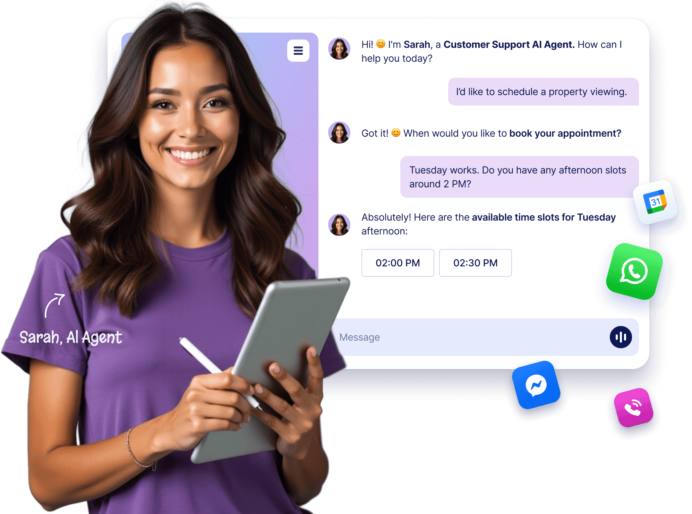

  

YatriAI | AI Agent
#YatriAI Agents are powerful automated customer service tools that provide real-time assistance, answer user queries, and guide customers through processes like form-filling and troubleshooting. By offering personalized, conversational AI interactions and 24-7 availability, they enhance customer satisfaction, streamline support workflows, and reduce response times, ensuring a seamless and efficient customer experience.

Topic -  
1> The Future of Customer Service 
2>Create an AI Agent 

3>Demo YatriAI Agents in action  --- 
A>Phone Agent 
B> Chatbot Agent  
C>WhatsApp  
D>Voice Agent  
E>Messenger  
F>Agent App 
G>Standalone Agent  
H>Kiosk Agent 

4>7,000+AI Agent Templates 
5>Boost your AI Agents with Powerful Tools 
6>Mobile App for Human Escalation 
7>Real Businesses. Real Results. 
8>FAQ 

#Technology - HTML | CSS |  BOOTSTRAP | JAVA SCRIPT
